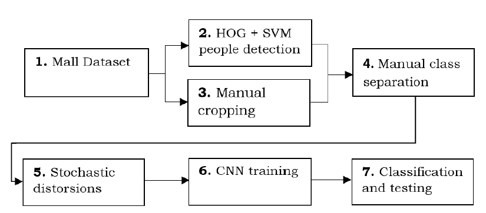

# Pedestrian Detection and Gender Recognition Project

This project implements a comprehensive system for **Pedestrian Detection and Gender Recognition from Non-Intrusive Camera Videos using Convolutional Neural Networks (CNNs)**.

## Overview

The system combines pedestrian detection algorithms with gender classification to analyze video footage from surveillance cameras. It uses deep learning techniques to automatically detect people in video frames and classify their gender, providing valuable insights for various applications including crowd analysis, demographic studies, and security systems.

## Key Features

- **Pedestrian Detection**: Multiple algorithms implemented including ACF, HOG-based detectors, and custom implementations
- **Gender Recognition**: CNN-based classification using Lasagne/Theano framework
- **Data Augmentation**: Techniques to extend datasets and improve model robustness
- **Performance Evaluation**: Comprehensive testing with confusion matrices and accuracy metrics
- **GPU Support**: Optimized for GPU acceleration using Theano

## Project Structure

### Main Implementation (`Gender_Recognition_Federico_Zanetti/`)
- `gender_recognition_jpg.py`: Main CNN training and testing script
- `gender_recognition_jpg_savepeople3.py`: Extended version with confusion matrix computation
- `change_format.py`: Image format conversion utilities
- `main_manual_people_crop.m`: MATLAB script for manual pedestrian patch extraction
- `extend_dataset_fede.m`: Data augmentation script
- `PeopleDetector_fede2.m`: Pedestrian detection implementation
- `test_gpu.py`: GPU functionality verification

### Literature and Research (`Literature/`)
- Multiple pedestrian detection algorithms (alg0-alg6)
- Gender classification research papers and references
- Implementation examples from various sources

### Test Results (`Test-1/`, `Test-2/`)
- Pre-trained CNN weights with different accuracy levels
- Model checkpoints from various training runs

## Technical Details

### CNN Architecture
- Input: 64x32 pixel images
- Multiple convolutional layers with pooling and normalization
- Dense layers for classification
- Binary classification (Male/Female)

### Dependencies
- **Python**: NumPy, SciPy, Matplotlib, Scikit-learn, Scikit-image
- **Deep Learning**: Theano, Lasagne, nolearn
- **MATLAB**: Computer Vision Toolbox for preprocessing

### Training Parameters
- Batch size: 16
- Learning rate: 0.001
- Momentum: 0.9
- Epochs: Configurable (default 20)

## Installation

### Prerequisites
```bash
# Ubuntu/Debian
sudo apt-get install python-dev g++ libblas-dev
sudo apt-get install python-matplotlib ipython ipython-notebook
sudo apt-get install python-pandas python-sympy python-nose

# Python packages
pip install numpy scipy scikit-image scikit-learn
pip install Theano Lasagne
pip install git+https://github.com/dnouri/nolearn.git@master#egg=nolearn==0.7.git
```

### MATLAB Setup
Requires MATLAB Computer Vision Toolbox for pedestrian detection preprocessing.

## Usage

### Training
```python
python gender_recognition_jpg.py
```

### Testing
Set `do_only_testing = 1` in the script parameters for evaluation mode.

### Data Preparation
1. Use MATLAB scripts for pedestrian patch extraction
2. Run `extend_dataset_fede.m` for data augmentation
3. Convert formats using `change_format.py`

## Results

The project includes trained models achieving up to 86%+ accuracy on gender classification tasks, with comprehensive evaluation metrics and confusion matrices.

## Block Diagram



## Author

**Federico Zanetti**
- Email: federico.zanetti@studenti.unitn.it
- Date: March 06, 2017

## Academic Context

This project was developed as part of machine learning and multimedia studies at Università degli Studi di Trento.

## License

[Add appropriate license information]